# C4 Model Diagrams

The C4 model provides a hierarchical way to visualize software architecture at different abstraction levels: Context, Containers, Components, and Code.

## Contents

- [Abstraction Levels](#abstraction-levels)
- [System Context Diagram](#system-context-diagram)
- [Container Diagram](#container-diagram)
- [Component Diagram](#component-diagram)
- [Elements Reference](#elements-reference)
- [E-Commerce Platform Example](#e-commerce-platform-example)
- [Architecture Patterns](#architecture-patterns)
- [Best Practices](#best-practices)

## Abstraction Levels

| Level | Shows | Audience |
|-------|-------|----------|
| **Context** | System + users + external dependencies | Everyone |
| **Container** | Applications, databases, services | Technical staff |
| **Component** | Internal structure of containers | Developers |
| **Code** | Class/code level detail | Developers |

## System Context Diagram

Shows the big picture: your system, its users, and external systems.

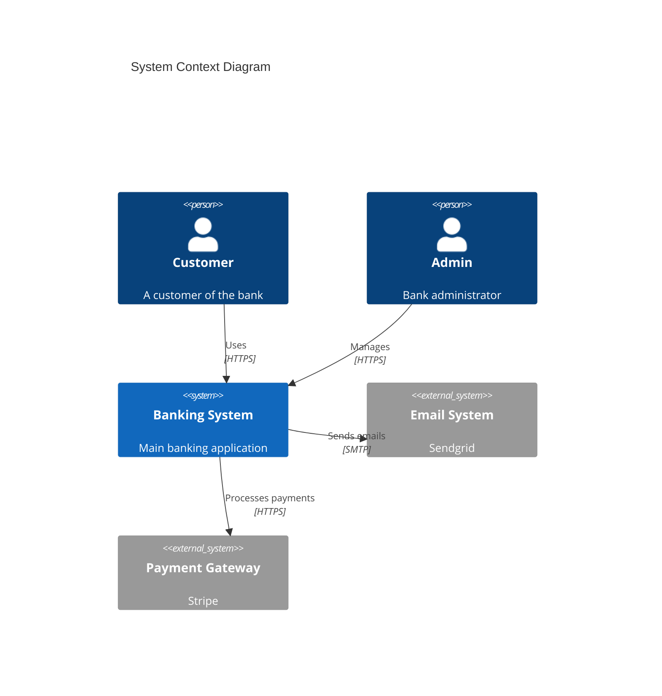
```mermaid
C4Context
    title System Context Diagram

    Person(customer, "Customer", "A customer of the bank")
    Person(admin, "Admin", "Bank administrator")

    System(bankSystem, "Banking System", "Main banking application")

    System_Ext(emailSystem, "Email System", "Sendgrid")
    System_Ext(paymentGateway, "Payment Gateway", "Stripe")

    Rel(customer, bankSystem, "Uses", "HTTPS")
    Rel(admin, bankSystem, "Manages", "HTTPS")
    Rel(bankSystem, emailSystem, "Sends emails", "SMTP")
    Rel(bankSystem, paymentGateway, "Processes payments", "HTTPS")
```

## Container Diagram

Zooms into a system to show applications, databases, and how they communicate.

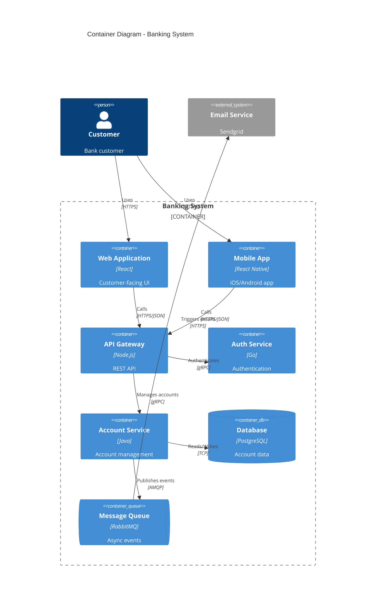
```mermaid
C4Container
    title Container Diagram - Banking System

    Person(customer, "Customer", "Bank customer")

    Container_Boundary(bankSystem, "Banking System") {
        Container(webApp, "Web Application", "React", "Customer-facing UI")
        Container(mobileApp, "Mobile App", "React Native", "iOS/Android app")
        Container(api, "API Gateway", "Node.js", "REST API")
        Container(authService, "Auth Service", "Go", "Authentication")
        Container(accountService, "Account Service", "Java", "Account management")
        ContainerDb(db, "Database", "PostgreSQL", "Account data")
        ContainerQueue(queue, "Message Queue", "RabbitMQ", "Async events")
    }

    System_Ext(email, "Email Service", "Sendgrid")

    Rel(customer, webApp, "Uses", "HTTPS")
    Rel(customer, mobileApp, "Uses", "HTTPS")
    Rel(webApp, api, "Calls", "HTTPS/JSON")
    Rel(mobileApp, api, "Calls", "HTTPS/JSON")
    Rel(api, authService, "Authenticates", "gRPC")
    Rel(api, accountService, "Manages accounts", "gRPC")
    Rel(accountService, db, "Reads/Writes", "TCP")
    Rel(accountService, queue, "Publishes events", "AMQP")
    Rel(queue, email, "Triggers emails", "HTTPS")
```

## Component Diagram

Shows the internal structure of a container.

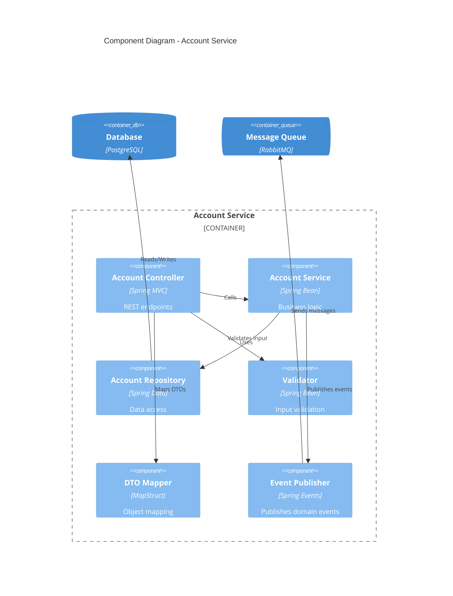
```mermaid
C4Component
    title Component Diagram - Account Service

    Container_Boundary(accountService, "Account Service") {
        Component(controller, "Account Controller", "Spring MVC", "REST endpoints")
        Component(service, "Account Service", "Spring Bean", "Business logic")
        Component(repository, "Account Repository", "Spring Data", "Data access")
        Component(validator, "Validator", "Spring Bean", "Input validation")
        Component(mapper, "DTO Mapper", "MapStruct", "Object mapping")
        Component(events, "Event Publisher", "Spring Events", "Publishes domain events")
    }

    ContainerDb(db, "Database", "PostgreSQL")
    ContainerQueue(queue, "Message Queue", "RabbitMQ")

    Rel(controller, validator, "Validates input")
    Rel(controller, mapper, "Maps DTOs")
    Rel(controller, service, "Calls")
    Rel(service, repository, "Uses")
    Rel(service, events, "Publishes events")
    Rel(repository, db, "Reads/Writes")
    Rel(events, queue, "Sends messages")
```

## Elements Reference

### People

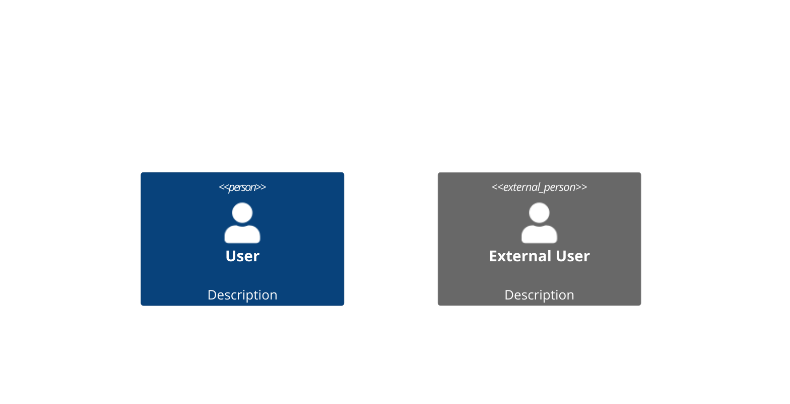
```mermaid
C4Context
    Person(user, "User", "Description")
    Person_Ext(external, "External User", "Description")
```

### Systems

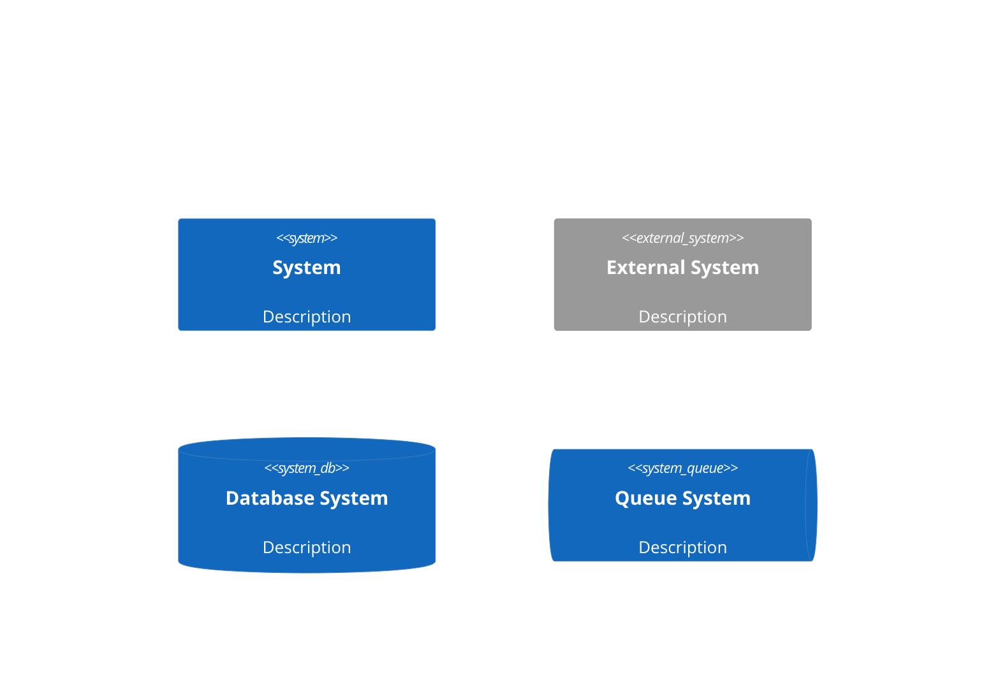
```mermaid
C4Context
    System(sys, "System", "Description")
    System_Ext(ext, "External System", "Description")
    SystemDb(db, "Database System", "Description")
    SystemQueue(queue, "Queue System", "Description")
```

### Containers

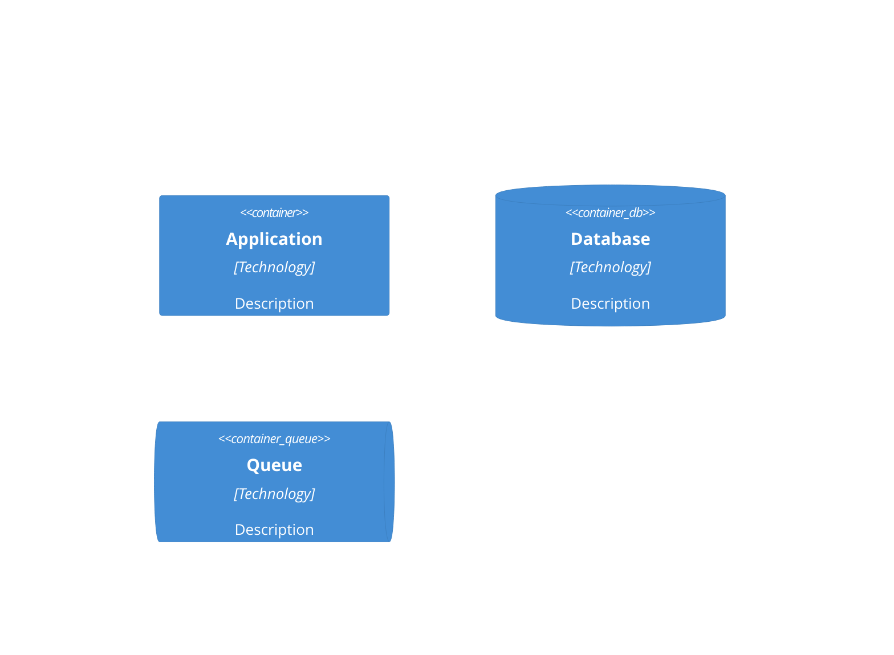
```mermaid
C4Container
    Container(app, "Application", "Technology", "Description")
    ContainerDb(db, "Database", "Technology", "Description")
    ContainerQueue(queue, "Queue", "Technology", "Description")
```

### Components

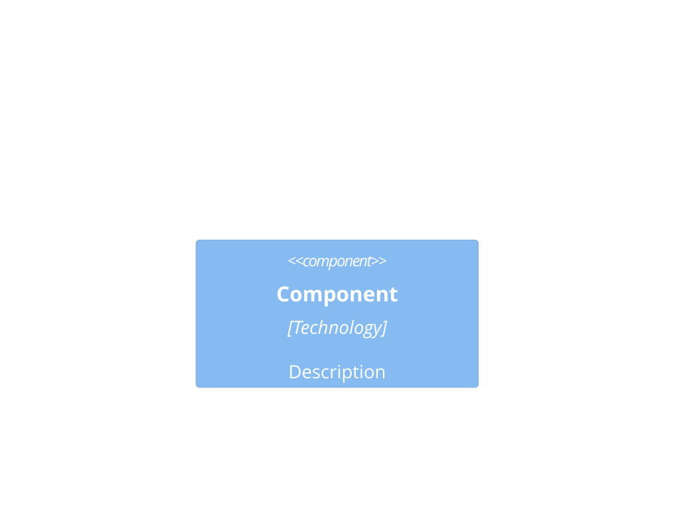
```mermaid
C4Component
    Component(comp, "Component", "Technology", "Description")
```

### Boundaries

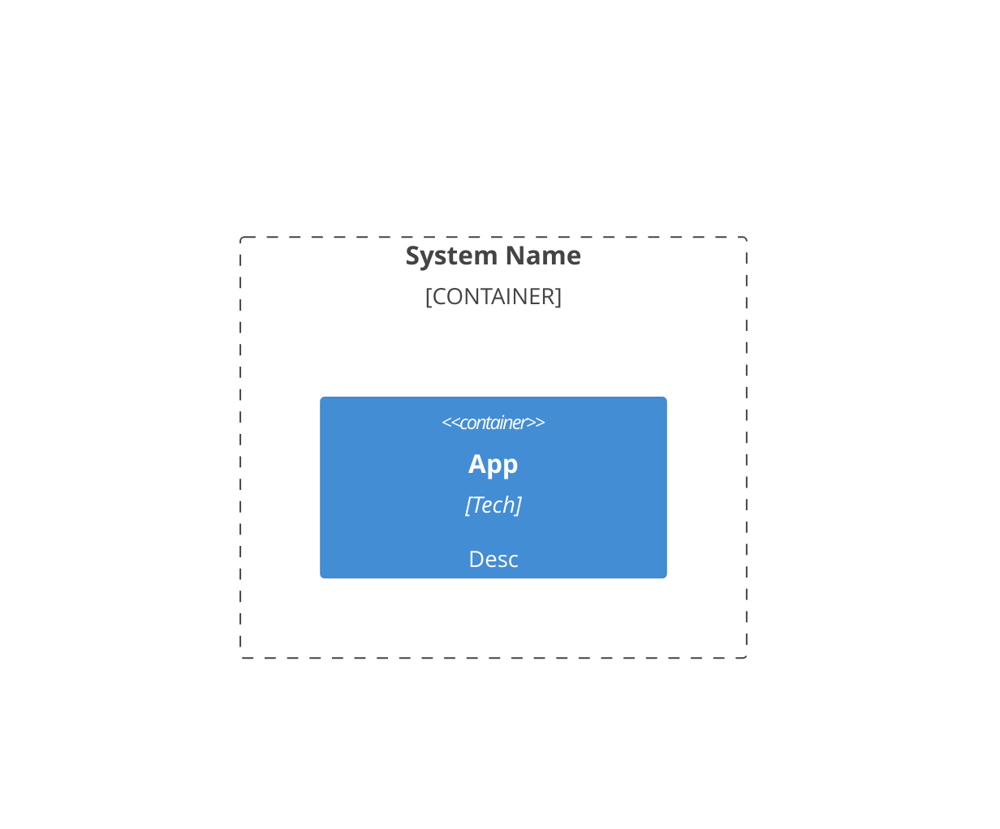
```mermaid
C4Container
    Container_Boundary(boundary, "System Name") {
        Container(app, "App", "Tech", "Desc")
    }
```

### Relationships

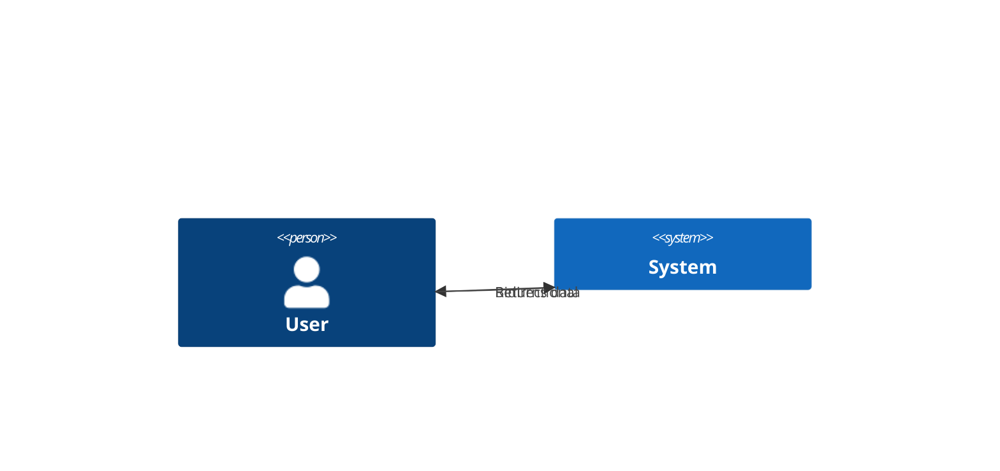
```mermaid
C4Context
    Person(user, "User", "")
    System(sys, "System", "")

    Rel(user, sys, "Uses", "HTTPS")
    Rel_Back(sys, user, "Returns data")
    BiRel(user, sys, "Bidirectional")
```

## E-Commerce Platform Example

### Context Level

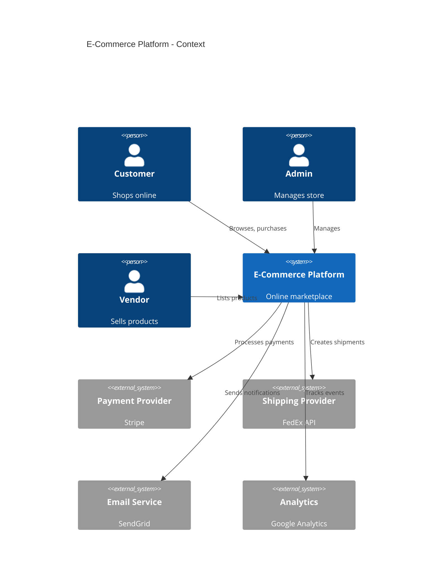
```mermaid
C4Context
    title E-Commerce Platform - Context

    Person(customer, "Customer", "Shops online")
    Person(admin, "Admin", "Manages store")
    Person(vendor, "Vendor", "Sells products")

    System(ecommerce, "E-Commerce Platform", "Online marketplace")

    System_Ext(payment, "Payment Provider", "Stripe")
    System_Ext(shipping, "Shipping Provider", "FedEx API")
    System_Ext(email, "Email Service", "SendGrid")
    System_Ext(analytics, "Analytics", "Google Analytics")

    Rel(customer, ecommerce, "Browses, purchases")
    Rel(admin, ecommerce, "Manages")
    Rel(vendor, ecommerce, "Lists products")
    Rel(ecommerce, payment, "Processes payments")
    Rel(ecommerce, shipping, "Creates shipments")
    Rel(ecommerce, email, "Sends notifications")
    Rel(ecommerce, analytics, "Tracks events")
```

### Container Level

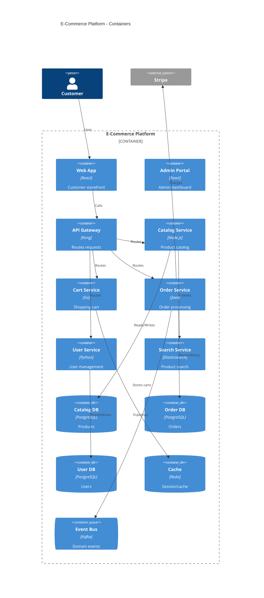
```mermaid
C4Container
    title E-Commerce Platform - Containers

    Person(customer, "Customer", "")

    Container_Boundary(ecommerce, "E-Commerce Platform") {
        Container(spa, "Web App", "React", "Customer storefront")
        Container(admin, "Admin Portal", "React", "Admin dashboard")
        Container(api, "API Gateway", "Kong", "Routes requests")
        Container(catalog, "Catalog Service", "Node.js", "Product catalog")
        Container(cart, "Cart Service", "Go", "Shopping cart")
        Container(order, "Order Service", "Java", "Order processing")
        Container(user, "User Service", "Python", "User management")
        Container(search, "Search Service", "Elasticsearch", "Product search")
        ContainerDb(catalogDb, "Catalog DB", "PostgreSQL", "Products")
        ContainerDb(orderDb, "Order DB", "PostgreSQL", "Orders")
        ContainerDb(userDb, "User DB", "PostgreSQL", "Users")
        ContainerDb(cache, "Cache", "Redis", "Session/cache")
        ContainerQueue(events, "Event Bus", "Kafka", "Domain events")
    }

    System_Ext(payment, "Stripe", "")

    Rel(customer, spa, "Uses")
    Rel(spa, api, "Calls")
    Rel(api, catalog, "Routes")
    Rel(api, cart, "Routes")
    Rel(api, order, "Routes")
    Rel(api, user, "Routes")
    Rel(catalog, catalogDb, "Reads/Writes")
    Rel(catalog, search, "Indexes")
    Rel(order, orderDb, "Reads/Writes")
    Rel(order, events, "Publishes")
    Rel(order, payment, "Charges")
    Rel(user, userDb, "Reads/Writes")
    Rel(cart, cache, "Stores carts")
```

## Architecture Patterns

### Monolithic Application

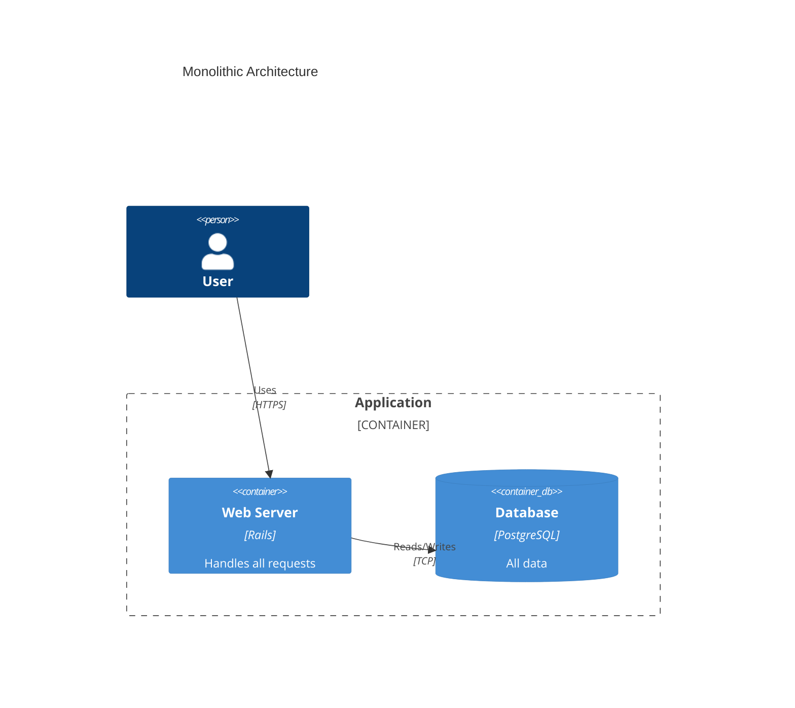
```mermaid
C4Container
    title Monolithic Architecture

    Person(user, "User", "")

    Container_Boundary(system, "Application") {
        Container(web, "Web Server", "Rails", "Handles all requests")
        ContainerDb(db, "Database", "PostgreSQL", "All data")
    }

    Rel(user, web, "Uses", "HTTPS")
    Rel(web, db, "Reads/Writes", "TCP")
```

### Three-Tier Architecture

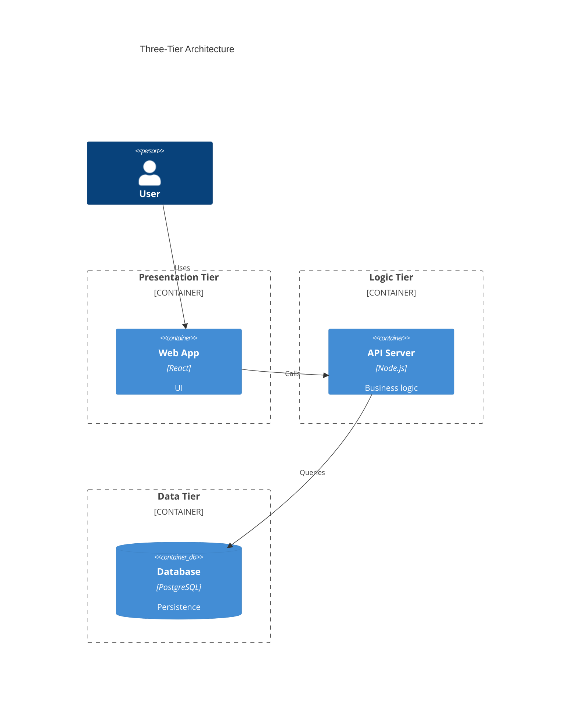
```mermaid
C4Container
    title Three-Tier Architecture

    Person(user, "User", "")

    Container_Boundary(presentation, "Presentation Tier") {
        Container(web, "Web App", "React", "UI")
    }

    Container_Boundary(logic, "Logic Tier") {
        Container(api, "API Server", "Node.js", "Business logic")
    }

    Container_Boundary(data, "Data Tier") {
        ContainerDb(db, "Database", "PostgreSQL", "Persistence")
    }

    Rel(user, web, "Uses")
    Rel(web, api, "Calls")
    Rel(api, db, "Queries")
```

### Event-Driven Architecture

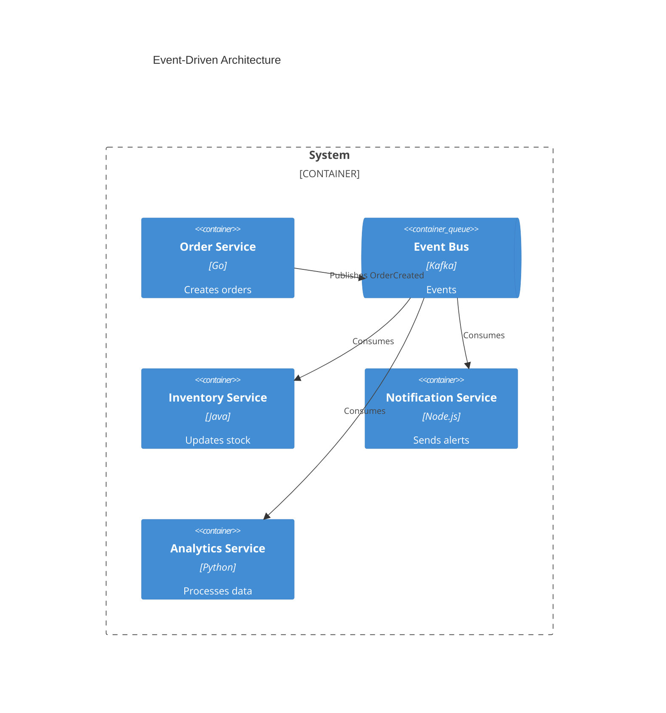
```mermaid
C4Container
    title Event-Driven Architecture

    Container_Boundary(system, "System") {
        Container(producer, "Order Service", "Go", "Creates orders")
        ContainerQueue(bus, "Event Bus", "Kafka", "Events")
        Container(inventory, "Inventory Service", "Java", "Updates stock")
        Container(notification, "Notification Service", "Node.js", "Sends alerts")
        Container(analytics, "Analytics Service", "Python", "Processes data")
    }

    Rel(producer, bus, "Publishes OrderCreated")
    Rel(bus, inventory, "Consumes")
    Rel(bus, notification, "Consumes")
    Rel(bus, analytics, "Consumes")
```

## Dynamic Diagrams

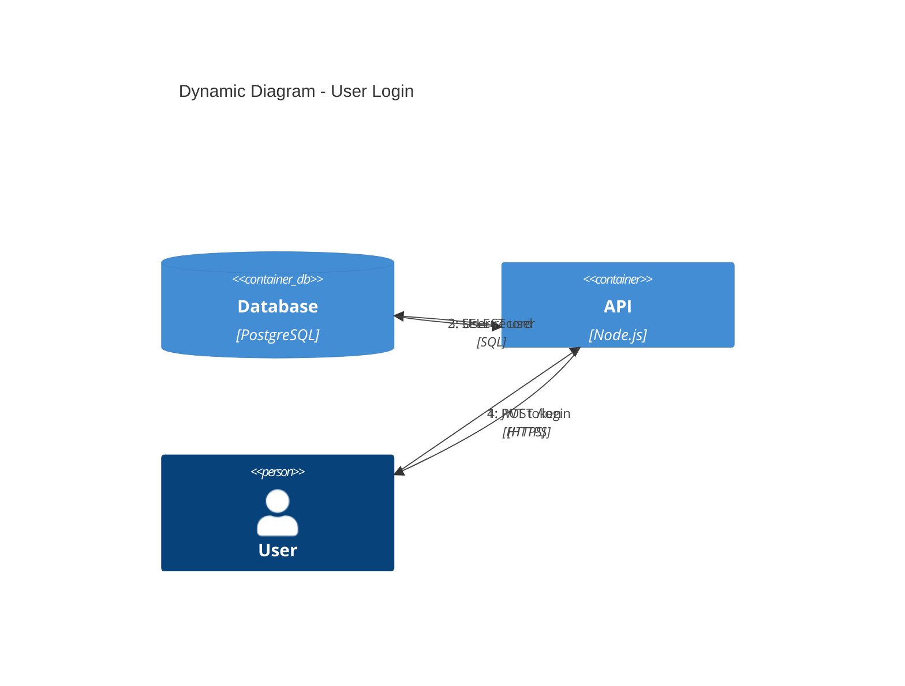
```mermaid
C4Dynamic
    title Dynamic Diagram - User Login

    ContainerDb(db, "Database", "PostgreSQL")
    Container(api, "API", "Node.js")
    Person(user, "User", "")

    RelIndex(1, user, api, "POST /login", "HTTPS")
    RelIndex(2, api, db, "SELECT user", "SQL")
    RelIndex(3, db, api, "User record")
    RelIndex(4, api, user, "JWT token", "HTTPS")
```

## Deployment Diagrams

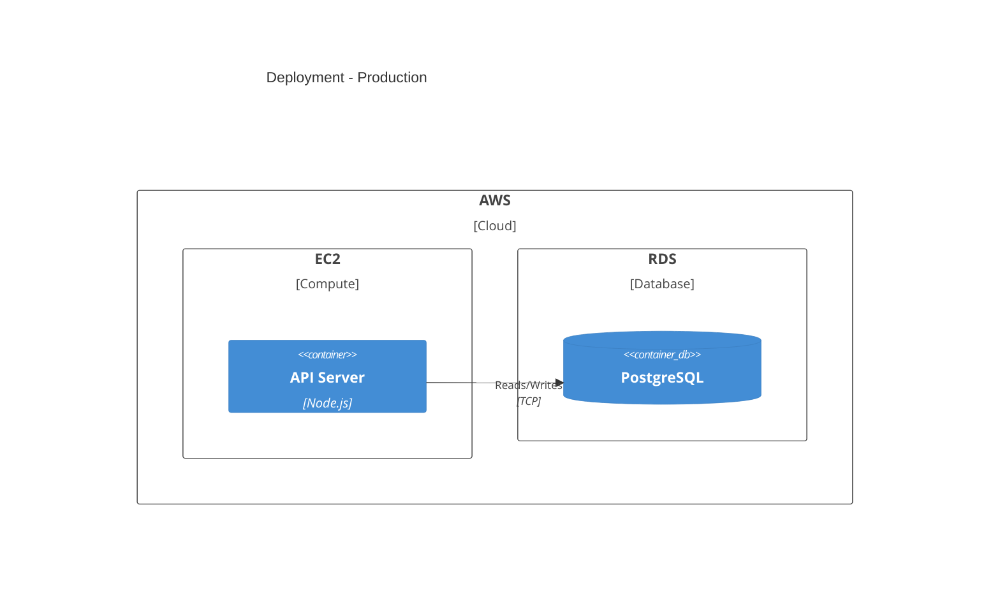
```mermaid
C4Deployment
    title Deployment - Production

    Deployment_Node(aws, "AWS", "Cloud") {
        Deployment_Node(ec2, "EC2", "Compute") {
            Container(api, "API Server", "Node.js")
        }
        Deployment_Node(rds, "RDS", "Database") {
            ContainerDb(db, "PostgreSQL", "")
        }
    }

    Rel(api, db, "Reads/Writes", "TCP")
```

## Styling

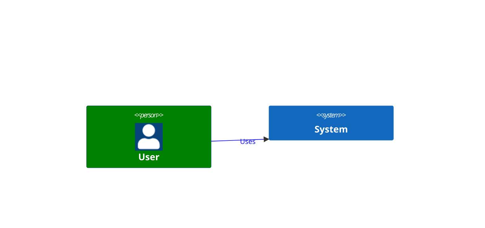
```mermaid
C4Context
    Person(user, "User", "")
    System(sys, "System", "")
    Rel(user, sys, "Uses")

    UpdateElementStyle(user, $bgColor="green", $fontColor="white")
    UpdateRelStyle(user, sys, $textColor="blue", $lineColor="blue")
    UpdateLayoutConfig($c4ShapeInRow="3", $c4BoundaryInRow="1")
```

## Best Practices

1. **NEVER use `\n`** — Use ` ` in labels if multi-line text is needed
2. **Use appropriate abstraction** — Context for stakeholders, Components for developers
3. **Keep diagrams focused** — One concept per diagram
4. **Consistent naming** — Same names across all levels
5. **Specify technologies** — Include tech stack in containers/components
6. **Show key relationships** — Don't clutter with every connection
7. **Include descriptions** — Brief text explaining purpose
8. **Update regularly** — Keep diagrams in sync with architecture
9. **Use boundaries** — Group related elements clearly
10. **Label relationships** — Specify protocol/data type
11. **Progressive disclosure** — Start with Context, drill into details
