# Sequence Diagrams

Sequence diagrams show interactions between participants over time. Ideal for API flows, authentication sequences, and system component interactions.

## Contents

- [Basic Syntax](#basic-syntax)
- [Participants and Actors](#participants-and-actors)
- [Message Types](#message-types)
- [Activations](#activations)
- [Control Structures](#control-structures)
- [Notes](#notes)
- [Sequence Numbers](#sequence-numbers)
- [Complete Example: User Authentication](#complete-example-user-authentication)
- [API Request/Response Example](#api-requestresponse-example)
- [Best Practices](#best-practices)

## Basic Syntax

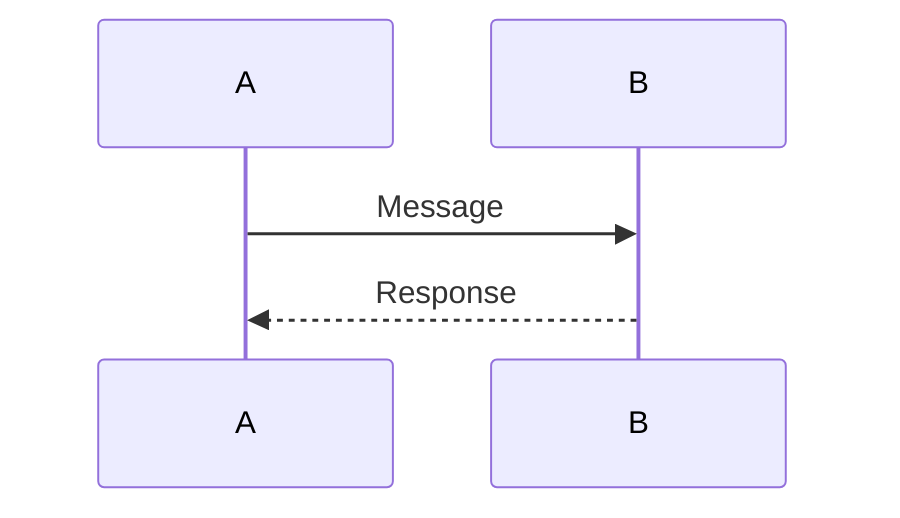
```mermaid
sequenceDiagram
    participant A
    participant B
    A->>B: Message
    B-->>A: Response
```

## Participants and Actors

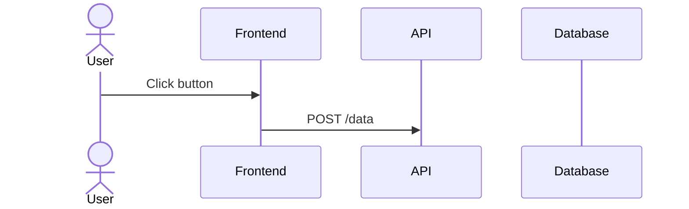
```mermaid
sequenceDiagram
    actor User
    participant Frontend
    participant API
    participant Database

    User->>Frontend: Click button
    Frontend->>API: POST /data
```

- `participant` - System components (services, classes, databases)
- `actor` - External entities (users, external systems)

## Message Types

### Synchronous (solid arrow)

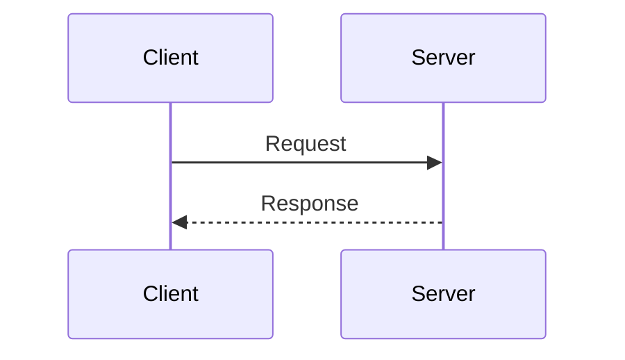
```mermaid
sequenceDiagram
    Client->>Server: Request
    Server-->>Client: Response
```

- `->>` Solid arrow (request)
- `-->>` Dotted arrow (response/return)

### Asynchronous (open arrow)

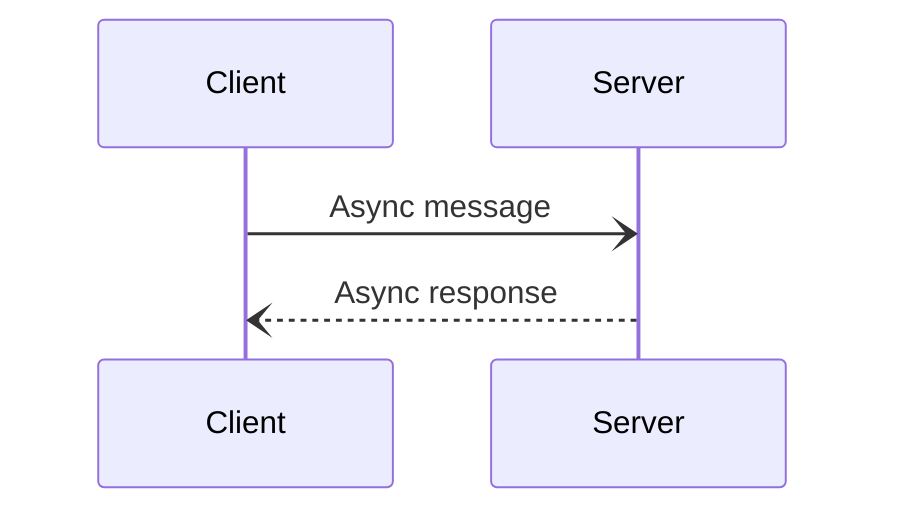
```mermaid
sequenceDiagram
    Client-)Server: Async message
    Server--)Client: Async response
```

- `-)` Solid open arrow
- `--)` Dotted open arrow

### Delete/Destroy

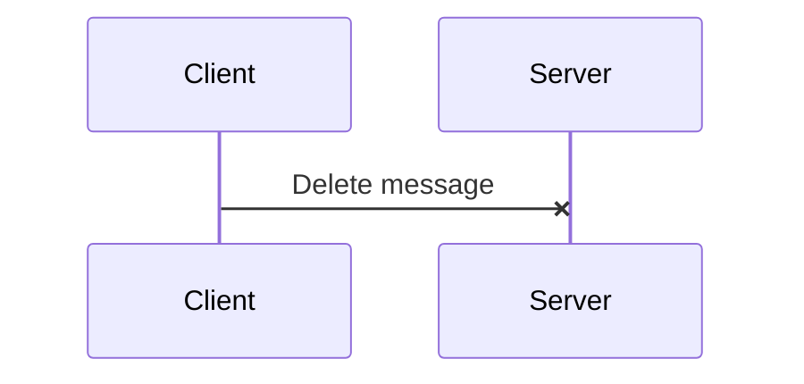
```mermaid
sequenceDiagram
    Client-xServer: Delete message
```

## Activations

Show when a participant is actively processing:

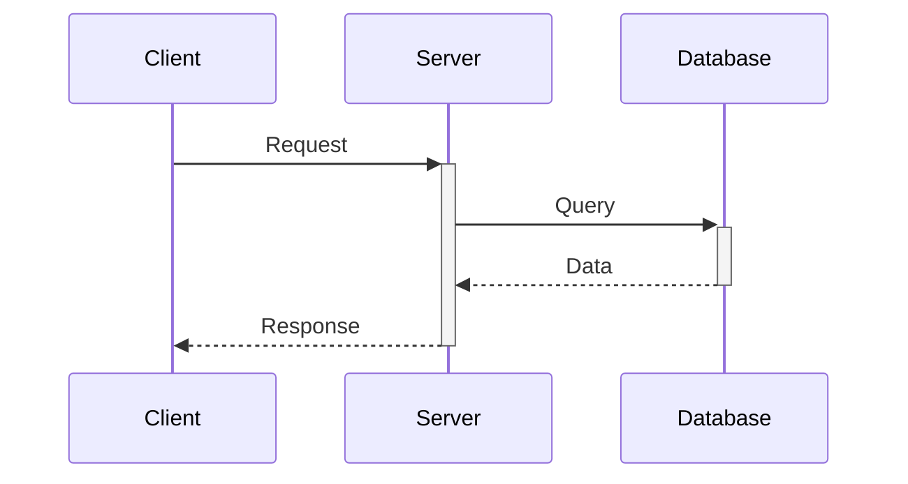
```mermaid
sequenceDiagram
    Client->>+Server: Request
    Server->>+Database: Query
    Database-->>-Server: Data
    Server-->>-Client: Response
```

- `+` after arrow activates
- `-` before arrow deactivates

## Control Structures

### Alt/Else (Conditional)

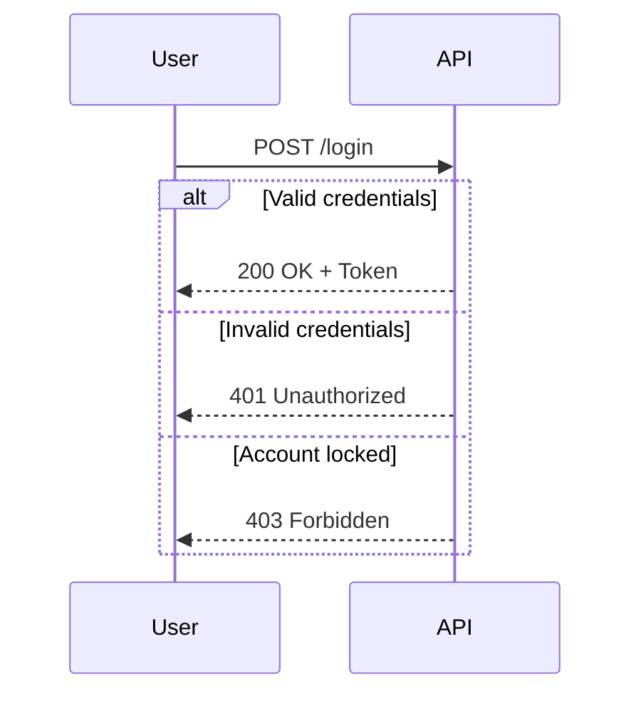
```mermaid
sequenceDiagram
    User->>API: POST /login

    alt Valid credentials
        API-->>User: 200 OK + Token
    else Invalid credentials
        API-->>User: 401 Unauthorized
    else Account locked
        API-->>User: 403 Forbidden
    end
```

### Opt (Optional)

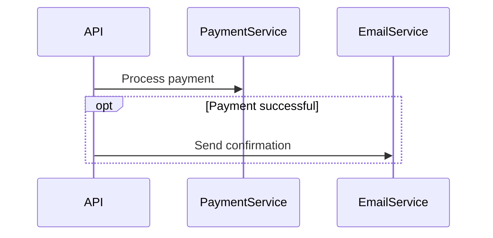
```mermaid
sequenceDiagram
    API->>PaymentService: Process payment

    opt Payment successful
        API->>EmailService: Send confirmation
    end
```

### Par (Parallel)

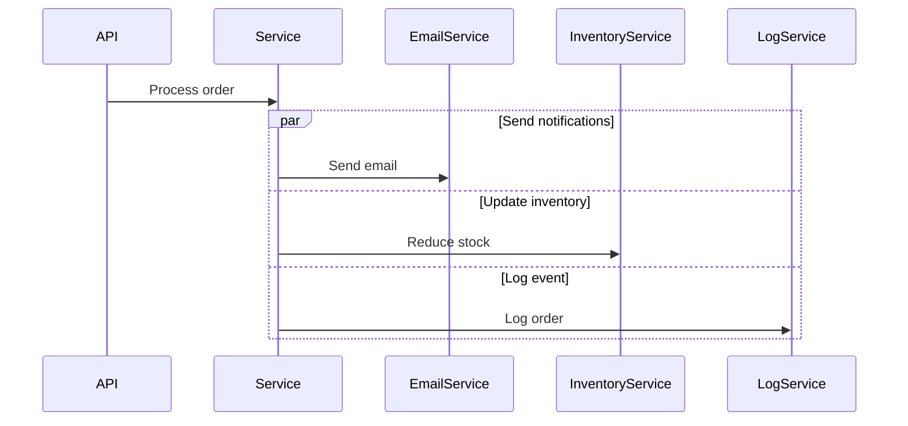
```mermaid
sequenceDiagram
    API->>Service: Process order

    par Send notifications
        Service->>EmailService: Send email
    and Update inventory
        Service->>InventoryService: Reduce stock
    and Log event
        Service->>LogService: Log order
    end
```

### Loop

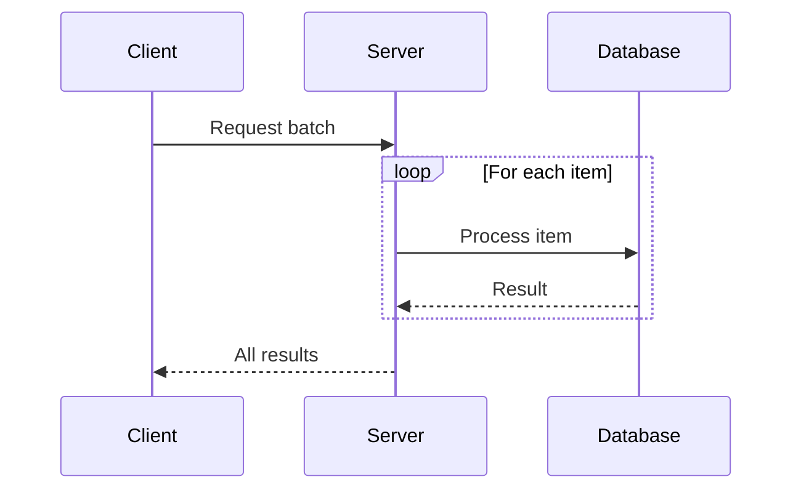
```mermaid
sequenceDiagram
    Client->>Server: Request batch

    loop For each item
        Server->>Database: Process item
        Database-->>Server: Result
    end

    Server-->>Client: All results
```

### Break (Early Exit)

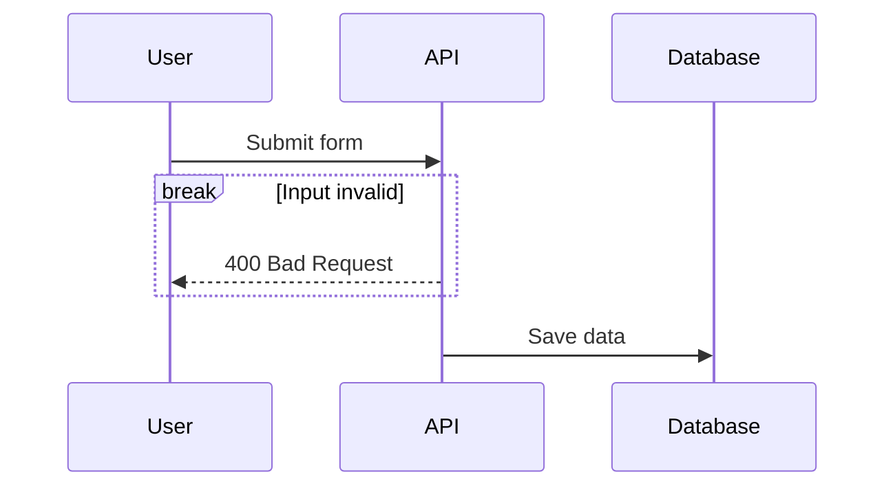
```mermaid
sequenceDiagram
    User->>API: Submit form

    break Input invalid
        API-->>User: 400 Bad Request
    end

    API->>Database: Save data
```

## Notes

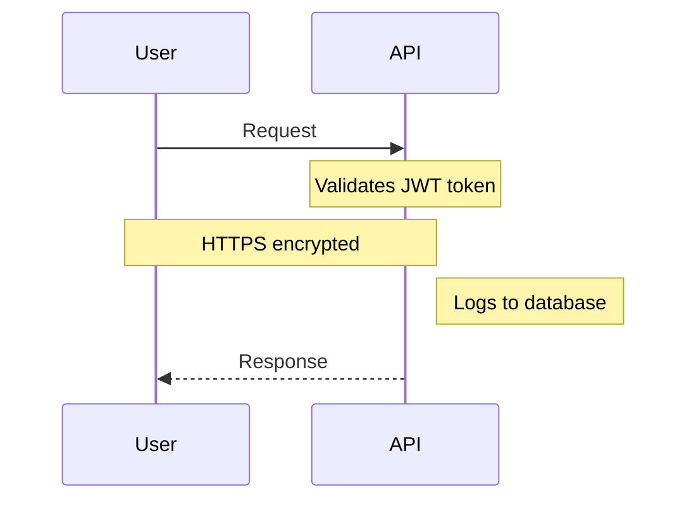
```mermaid
sequenceDiagram
    User->>API: Request
    Note over API: Validates JWT token
    Note over User,API: HTTPS encrypted
    Note right of API: Logs to database
    API-->>User: Response
```

## Sequence Numbers

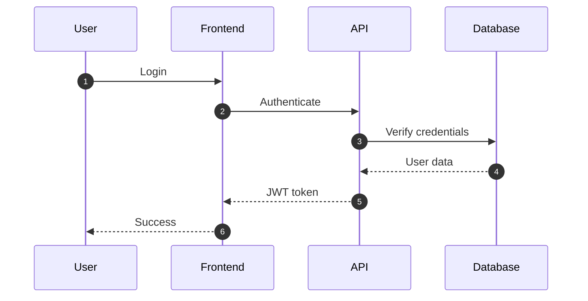
```mermaid
sequenceDiagram
    autonumber

    User->>Frontend: Login
    Frontend->>API: Authenticate
    API->>Database: Verify credentials
    Database-->>API: User data
    API-->>Frontend: JWT token
    Frontend-->>User: Success
```

## Complete Example: User Authentication

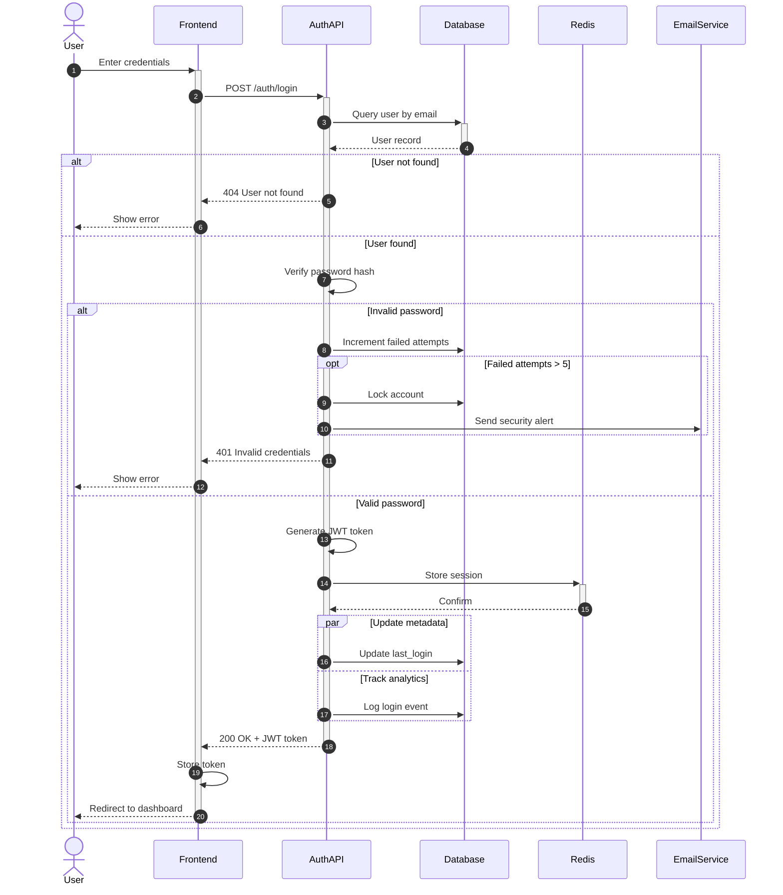
```mermaid
sequenceDiagram
    autonumber
    actor User
    participant Frontend
    participant AuthAPI
    participant Database
    participant Redis
    participant EmailService

    User->>+Frontend: Enter credentials
    Frontend->>+AuthAPI: POST /auth/login

    AuthAPI->>+Database: Query user by email
    Database-->>-AuthAPI: User record

    alt User not found
        AuthAPI-->>Frontend: 404 User not found
        Frontend-->>User: Show error
    else User found
        AuthAPI->>AuthAPI: Verify password hash

        alt Invalid password
            AuthAPI->>Database: Increment failed attempts

            opt Failed attempts > 5
                AuthAPI->>Database: Lock account
                AuthAPI->>EmailService: Send security alert
            end

            AuthAPI-->>Frontend: 401 Invalid credentials
            Frontend-->>User: Show error
        else Valid password
            AuthAPI->>AuthAPI: Generate JWT token
            AuthAPI->>+Redis: Store session
            Redis-->>-AuthAPI: Confirm

            par Update metadata
                AuthAPI->>Database: Update last_login
            and Track analytics
                AuthAPI->>Database: Log login event
            end

            AuthAPI-->>-Frontend: 200 OK + JWT token
            Frontend->>Frontend: Store token
            Frontend-->>-User: Redirect to dashboard
        end
    end
```

## API Request/Response Example

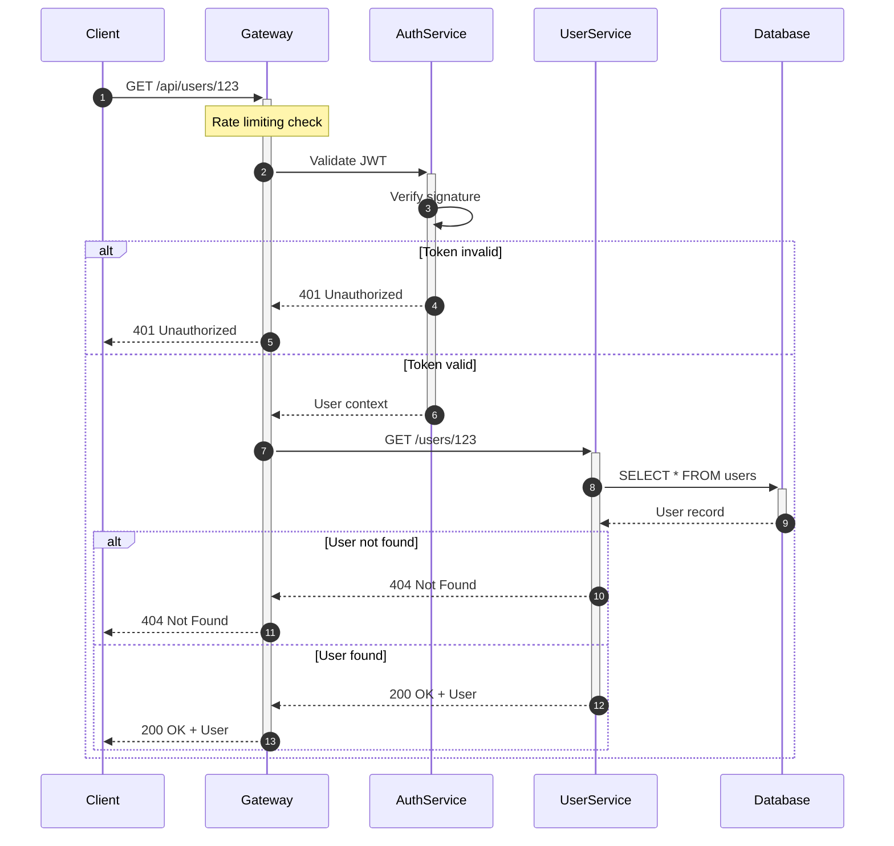
```mermaid
sequenceDiagram
    autonumber
    participant Client
    participant Gateway
    participant AuthService
    participant UserService
    participant Database

    Client->>+Gateway: GET /api/users/123
    Note over Gateway: Rate limiting check

    Gateway->>+AuthService: Validate JWT
    AuthService->>AuthService: Verify signature

    alt Token invalid
        AuthService-->>Gateway: 401 Unauthorized
        Gateway-->>Client: 401 Unauthorized
    else Token valid
        AuthService-->>-Gateway: User context

        Gateway->>+UserService: GET /users/123
        UserService->>+Database: SELECT * FROM users
        Database-->>-UserService: User record

        alt User not found
            UserService-->>Gateway: 404 Not Found
            Gateway-->>Client: 404 Not Found
        else User found
            UserService-->>-Gateway: 200 OK + User
            Gateway-->>-Client: 200 OK + User
        end
    end
```

## Bidirectional Arrows (v11.0.0+)

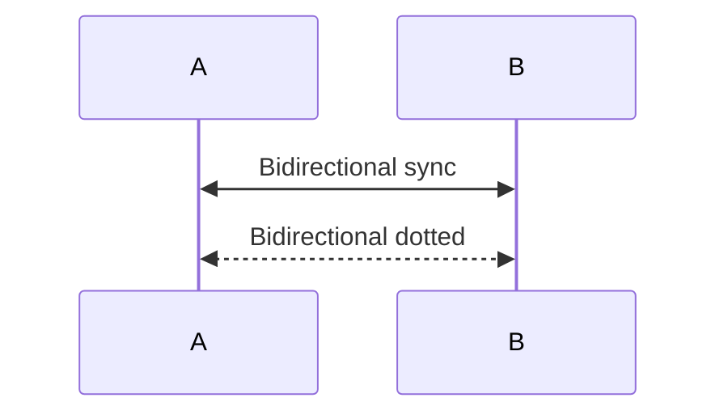
```mermaid
sequenceDiagram
    participant A
    participant B
    A <<->> B: Bidirectional sync
    A <<-->> B: Bidirectional dotted
```

## Participant Creation and Destruction (v10.3.0+)

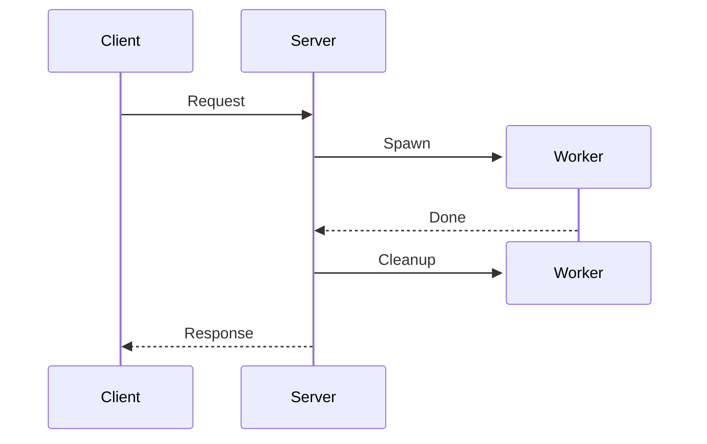
```mermaid
sequenceDiagram
    participant Client
    Client->>Server: Request
    create participant Worker
    Server->>Worker: Spawn
    Worker-->>Server: Done
    destroy Worker
    Server->>Worker: Cleanup
    Server-->>Client: Response
```

## Participant Grouping (Box)

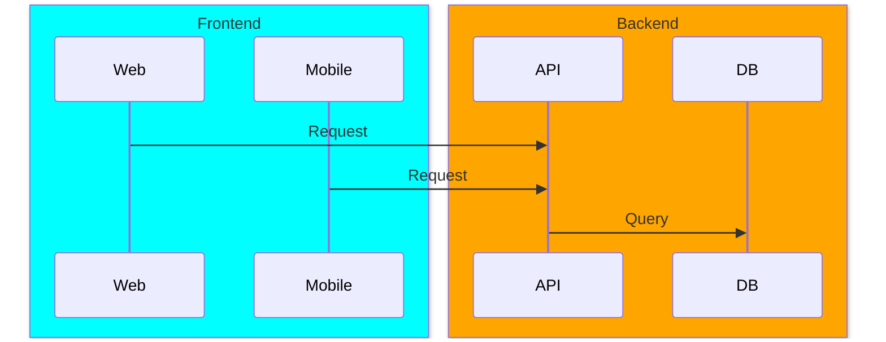
```mermaid
sequenceDiagram
    box Aqua Frontend
        participant Web
        participant Mobile
    end
    box Orange Backend
        participant API
        participant DB
    end
    Web->>API: Request
    Mobile->>API: Request
    API->>DB: Query
```

Supports `rgb()`, `rgba()`, `transparent`, and named colors.

## Background Highlighting

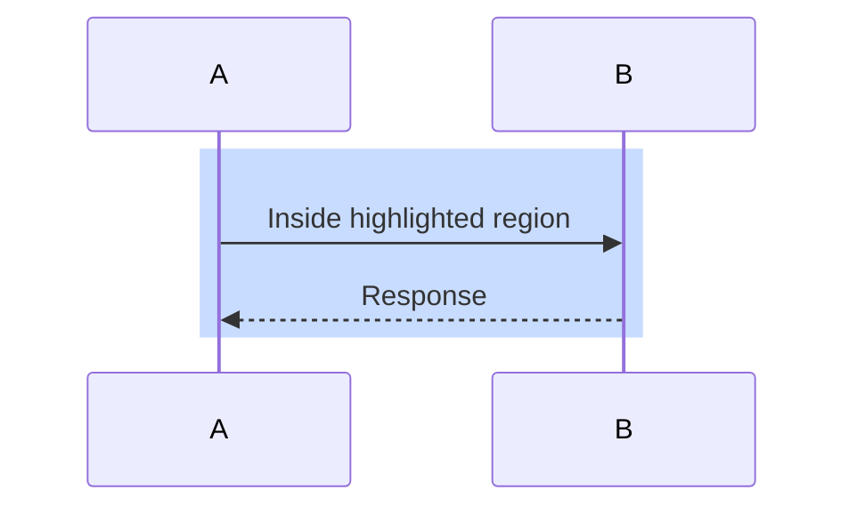
```mermaid
sequenceDiagram
    participant A
    participant B
    rect rgb(200, 220, 255)
        A->>B: Inside highlighted region
        B-->>A: Response
    end
```

## Critical Region

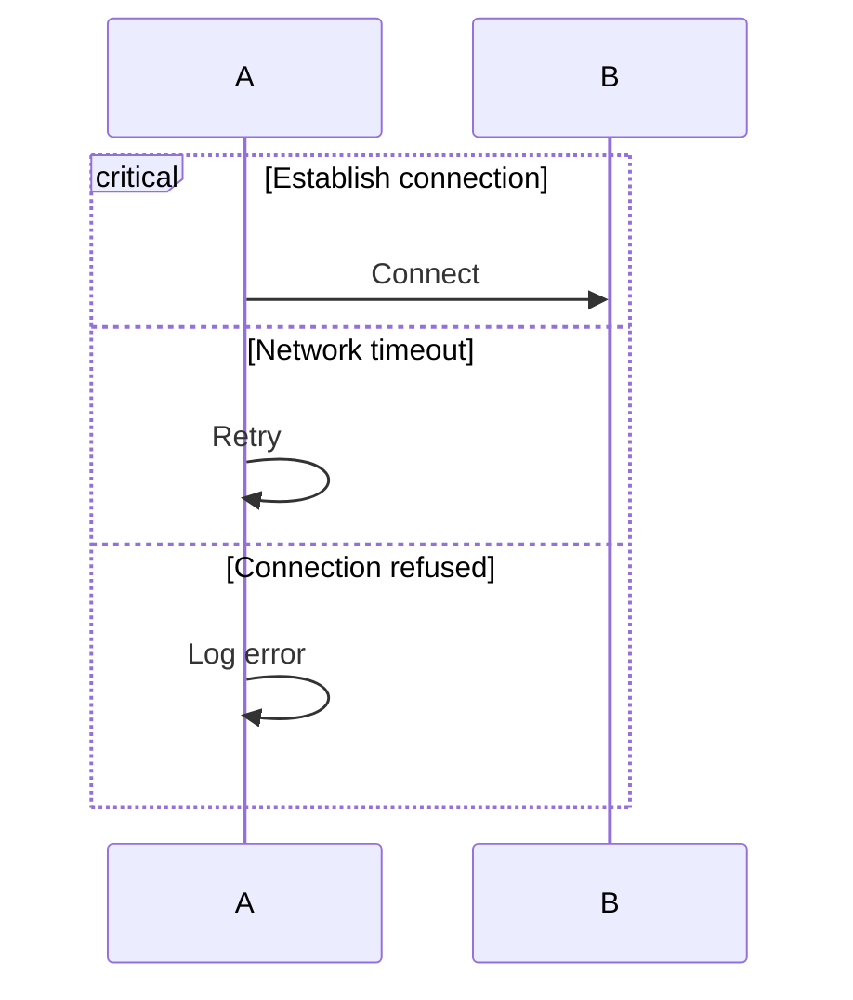
```mermaid
sequenceDiagram
    participant A
    participant B
    critical Establish connection
        A->>B: Connect
    option Network timeout
        A->>A: Retry
    option Connection refused
        A->>A: Log error
    end
```

## Best Practices

1. **NEVER use `\n`** — Use ` ` in labels if multi-line text is needed
2. **Order participants logically** — User -> Frontend -> Backend -> Database
3. **Use activations** — Shows when components are processing
4. **Group related logic** — Use alt/opt/par to organize flows
5. **Add descriptive notes** — Explain complex logic
6. **Keep diagrams focused** — One scenario per diagram
7. **Number messages** — Use autonumber for complex flows
8. **Show error paths** — Document failure scenarios
9. **Indicate async operations** — Use open arrows for fire-and-forget
10. **Use box grouping** — Visually group related participants
