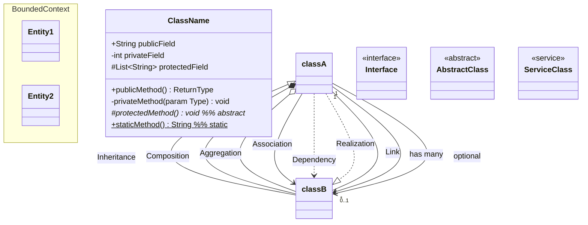
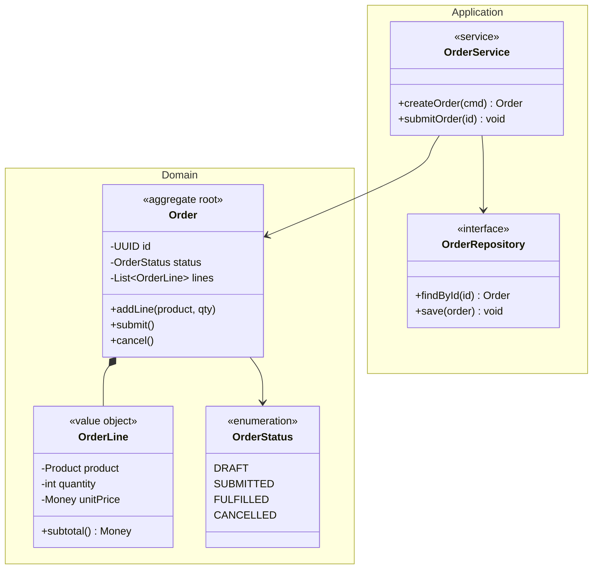

# Class Diagrams

Useful for domain models, bounded contexts, and entity structures.

## Syntax

```mermaid
classDiagram
  class ClassName {
    +String publicField
    -int privateField
    #List~String~ protectedField
    +publicMethod() ReturnType
    -privateMethod(param Type) void
    #protectedMethod()* void       %% abstract
    +staticMethod()$ String         %% static
  }

  classA <|-- classB : Inheritance
  classA *-- classB : Composition
  classA o-- classB : Aggregation
  classA --> classB : Association
  classA ..> classB : Dependency
  classA ..|> classB : Realization
  classA -- classB : Link

  %% Cardinality
  classA "1" --> "*" classB : has many
  classA "1" --> "0..1" classB : optional

  %% Annotations
  class Interface {
    <<interface>>
  }
  class AbstractClass {
    <<abstract>>
  }
  class ServiceClass {
    <<service>>
  }

  namespace BoundedContext {
    class Entity1
    class Entity2
  }
```

## Example — Clean Architecture Domain Model

```mermaid
classDiagram
  namespace Domain {
    class Order {
      <<aggregate root>>
      -UUID id
      -OrderStatus status
      -List~OrderLine~ lines
      +addLine(product, qty)
      +submit()
      +cancel()
    }
    class OrderLine {
      <<value object>>
      -Product product
      -int quantity
      -Money unitPrice
      +subtotal() Money
    }
    class OrderStatus {
      <<enumeration>>
      DRAFT
      SUBMITTED
      FULFILLED
      CANCELLED
    }
  }

  namespace Application {
    class OrderService {
      <<service>>
      +createOrder(cmd) Order
      +submitOrder(id) void
    }
    class OrderRepository {
      <<interface>>
      +findById(id) Order
      +save(order) void
    }
  }

  Order *-- OrderLine
  Order --> OrderStatus
  OrderService --> OrderRepository
  OrderService --> Order
```
