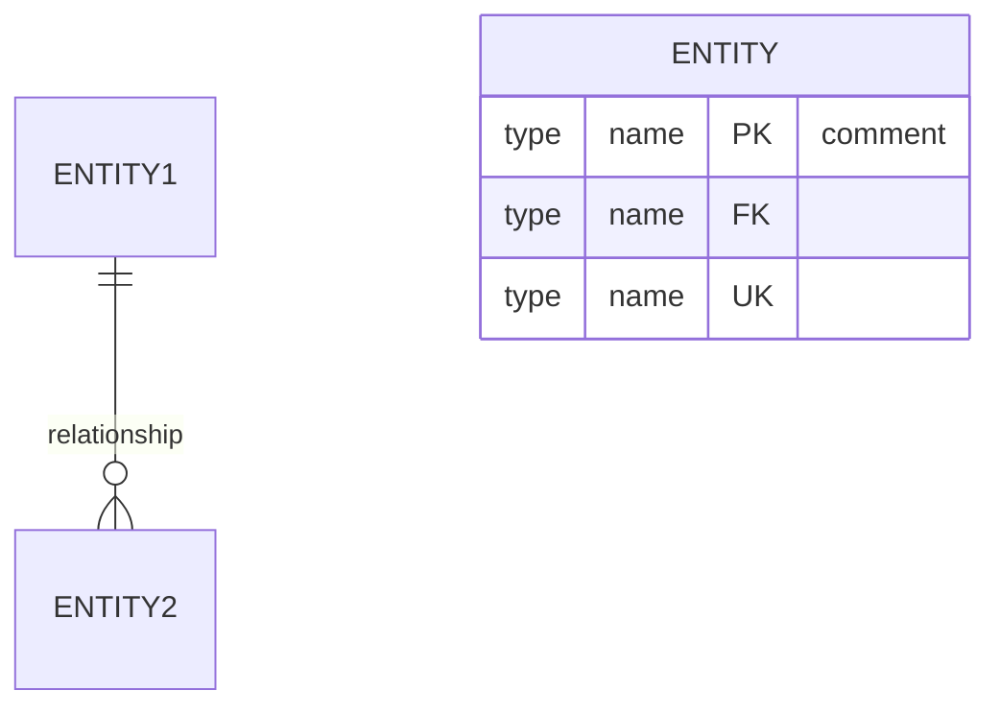
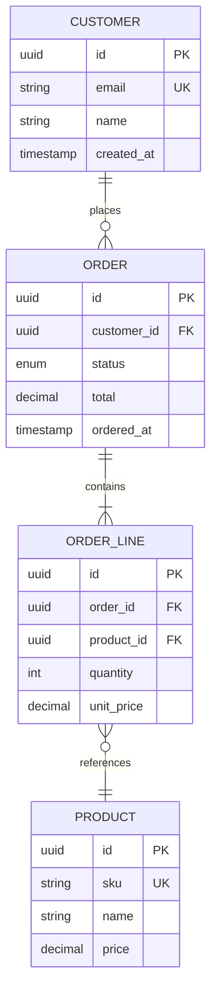

# ER Diagrams

For data models and database schemas.

## Relationship Syntax

```mermaid
erDiagram
  ENTITY1 ||--o{ ENTITY2 : "relationship"

  %% Cardinality:
  %% || = exactly one
  %% |{ = one or more
  %% o| = zero or one
  %% o{ = zero or more

  %% Line style:
  %% -- = identifying (solid)
  %% .. = non-identifying (dotted)

  ENTITY {
    type name PK "comment"
    type name FK
    type name UK
  }
```

## Example — Order Data Model

```mermaid
erDiagram
  CUSTOMER ||--o{ ORDER : places
  ORDER ||--|{ ORDER_LINE : contains
  ORDER_LINE }o--|| PRODUCT : references
  CUSTOMER {
    uuid id PK
    string email UK
    string name
    timestamp created_at
  }
  ORDER {
    uuid id PK
    uuid customer_id FK
    enum status
    decimal total
    timestamp ordered_at
  }
  ORDER_LINE {
    uuid id PK
    uuid order_id FK
    uuid product_id FK
    int quantity
    decimal unit_price
  }
  PRODUCT {
    uuid id PK
    string sku UK
    string name
    decimal price
  }
```
