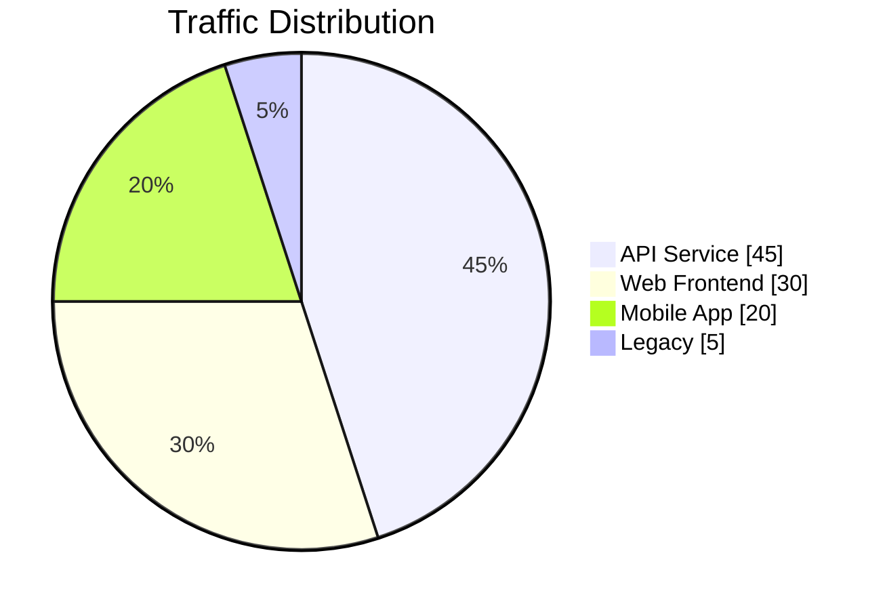

# Pie Charts

For proportions and distributions.

## Syntax

```mermaid
pie showData title Traffic Distribution
  "API Service" : 45
  "Web Frontend" : 30
  "Mobile App" : 20
  "Legacy" : 5
```

**Rules:** Values must be positive numbers. Labels in double quotes. `showData` displays values in legend.
