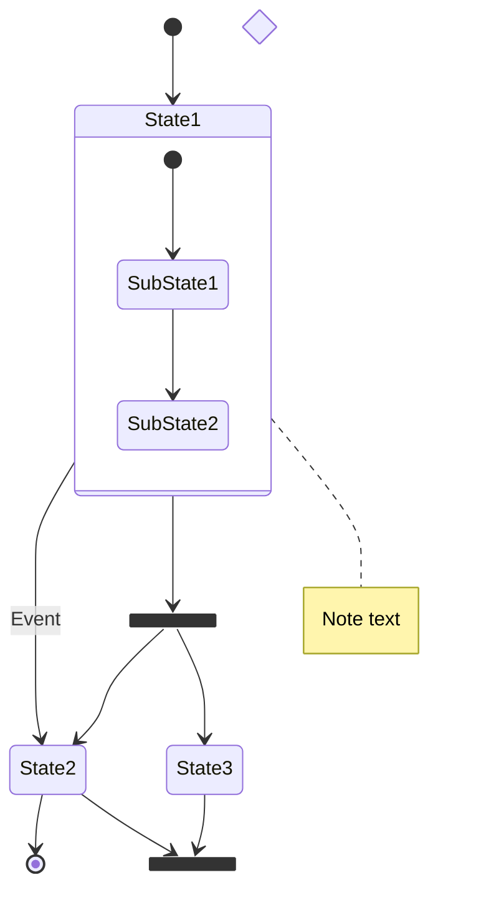

# State Diagrams

For lifecycle flows, state machines, and workflow states.

## Syntax

```mermaid
stateDiagram-v2
  [*] --> State1
  State1 --> State2 : Event
  State2 --> [*]

  state State1 {
    [*] --> SubState1
    SubState1 --> SubState2
  }

  state fork_state <<fork>>
  state join_state <<join>>
  state choice <<choice>>

  State1 --> fork_state
  fork_state --> State2
  fork_state --> State3
  State2 --> join_state
  State3 --> join_state

  note right of State1 : Note text
```
